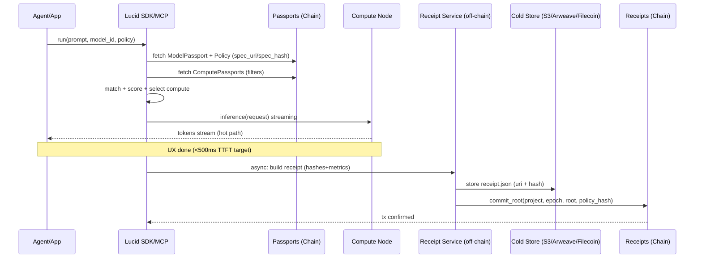

# Cahier des charges MVP — Lucid SDK + MCP (Passports + Asset Interaction)

# 0) Objectif (MVP)

Fournir un **SDK** (JS/TS + Python) et un **MCP server** permettant à n’importe quelle app/agent de :

1. **Publier, lire, MAJ un asset AI** (modèle, agent, dataset, compute…) avec une identité (**Passport**)
2. **Découvrir** des assets via recherche + filtres et les utiliser de manière interoperable.
3. **Matcher automatiquement** un **Model Passport** avec un **Compute Passport** compatible (format + runtime + contraintes).
4. **Exécuter une interaction** (ex: inference) via une **API unifiée** (OpenAI-compatible *si possible*)
5. **Tracer une preuve** de l’exécution
6. **Distribuer automatiquement les paiements** aux bons acteurs
7. Exposer ces capacités via **MCP** pour que ChatGPT/Claude/agents puissent **appeler Lucid** en tool-call standard.

👉 **Sans gérer l’infra**, **sans connaître Web3**, **sans casser la latence**

---

# 🧱 Architecture mentale (important)

- **Lucid Chain**
    
    → identité, preuves, pointeurs, paiements
    
    → **jamais de hot path**
    
- **Lucid SDK / MCP**
    
    → orchestration, matching, execution
    
    → **là où vit l’intelligence**
    
- **Hot Lane**
    
    → mémoire + RAG locale / proche du compute
    
    → gérée par l’app ou le node
    
- **Cold Lane**
    
    → mémoire portable, vérifiable, persistante
    
    → Filecoin / Arweave / S3-like
    

# 1) Personas & Use Cases (MVP)

## 1.1 Personas

- **Dev Web2** : veut appeler un modèle “passporté” sans comprendre crypto.
- **Builder Web3** : veut agent + actions on-chain (Solana/EVM) avec identité/receipts.
- **Compute operator (DePIN/Cloud)** : publie un compute compatible (runtimes).
- **Model creator** : publie un modèle HF + contraintes.
- **Enterprise** : veut policy, residency, attestation, receipts.

## 1.2 Use cases MVP incontournables

1. **Mint Passport** pour un modèle HF (Model Passport).
2. **Mint Passport** pour un compute (Compute Passport).
3. **Agent** : “Utiliser ce modèle” → SDK fait le matching compute → exécute inference.
4. **Receipt** : générer un run receipt + ancrage on-chain asynchrone.
5. **MCP** : “search model”, “run inference”, “get receipt”.

---

# 2) Périmètre MVP : ce qu’on fait / ce qu’on ne fait pas

## Inclus MVP

- Passports : Model / Compute / Tool / Dataset / Agent (minimaux)
- Registry + Search
- Matching Model↔Compute
- Execution (inference) via endpoint unifié (TrustGate/Fluid)
- Receipt service (hash + metadata) + anchor on-chain (root)
- SDK JS/TS + SDK Python
- MCP server avec tools Lucid

## Exclu MVP (v2+)

- VectorDB décentralisé “natif”
- Fine-tune / training multi-node
- Marketplace complet + pricing dynamique on-chain
- ZK proofs
- Payouts avancés / splits complexes (on peut laisser stub)

---

# 3) Architecture (MVP)

## 3.1 Composants

1. **Lucid Chain Programs (Solana)**
    - Passports registry (PDAs)
    - Receipt roots anchoring (MMR/Merkle)
    - (optionnel MVP) basic pointers/ACL
2. **Lucid Control Plane (off-chain)**
    - **Passport Indexer + Search API**
    - **Compatibility / Matching service**
    - **Execution gateway** (TrustGate / Fluid)
    - **Receipt service** (sign + store + anchor)
    - **Policy engine** (simple YAML/JSON)
3. **SDK (client)**
    - `passport.*`
    - `search.*`
    - `match.*`
    - `run.*`
    - `receipt.*`
4. **MCP Server**
    - expose les “tools” Lucid aux agents.

---

# 4) Spécifications : Passports (schémas MVP)

Chaque asset publié sur Lucid a un **Passport**.

## 4.1 Champs communs (tous Passports)

**PassportMeta**

- `passport_id` (PDA / address)
- `type`: `model | compute | dataset | tool | agent | app`
- metadata
    - name
    - description
    - tags
- `owner` (wallet / org id)
- `version` (semver)
- `created_at`, `updated_at`
- `license` (SPDX string)
- permissions: public | gated | private
- economics:
    - price_per_call
    - revenue_split
- `pointers`:
    - `manifest_uri` (HTTPS/S3/IPFS/Arweave)
    - `checksums` (sha256)
- proofs:
enabled: true/false

## 4.2 Model Passport (MVP)

### Formats supportés (MVP)

👉 **Standard obligatoire**

- `safetensors`
- `gguf` (optionnel CPU/edge)

### Runtimes supportés (MVP)

👉 **Lucid impose officiellement**

- `vLLM`
- `TGI`
- `TensorRT-LLM`

> ⚠️ Promets pas compatibilité universelle
> 
> 
> **80–90% coverage réaliste**
> 

**ModelMeta**

- `model_id` (passport_id)
- format: safetensors | gguf
- `license` (SPDX string)
- runtime_recommended: vllm | tgi | tensorrt
- `base`: `hf | openai | anthropic | custom_endpoint`
    - `hf` (si base=hf):
        - `repo_id` (ex: meta-llama/Llama-3.1-8B-Instruct)
        - `revision` (commit hash / tag)
- `context_length`
- `quantizations[]`: `fp16 | int8 | awq | gptq | gguf_q4`
- `requirements`:
    - `min_vram_gb`
    - `gpu_classes[]` (H100, A100, 4090)
    - `cuda_min?`
- `endpoints?` (si modèle déjà servi):
    - `openai_compat_base_url?`
    - `auth_mode`: `byok | lucid_key | none`
- `artifacts[]` (tokenizer/config/weights)
- [ ]  `weights_uri` + `weights_hash`
- checksums

## 4.3 Compute Passport (MVP)

👉 **Aucun compute n’est “universel”**

👉 Le matching est **déterministe**

**ComputeMeta**

- `compute_id` (passport_id)
- `provider_type`: `depin | cloud | onprem`
- `regions[]`
+ `residency_supported`
- `hardware`:
    - `gpu`: `H100-SXM | A100 | 4090 | ...`
    - `vram_gb`
    - arch
- `runtimes[]` + versions:
    - `vllm@x`, `tgi@y`, `trt@z`
- `capabilities`:
    - `supports_streaming: boolean`
    - `supports_attestation: boolean`
    - `supports_cc_on: boolean`
- `network`:
    - `p95_ms_estimate`
    - `bandwidth`
- limits :
    - max_context
    - max_batch
- `pricing` (MVP simple):
    - `price_per_1k_tokens_estimate?` ou `price_per_minute_estimate?`
- endpoints.inference_url

## 4.4 Agent Passport (MVP minimal)

- `persona` (system prompt hash + pointer)
- `tools[]` (refs vers Tool Passports)
- `default_model` (ref vers Model Passport)
- `memory_mode`: `shadow | lite | full`
- `channels[]` (refs : discord/x/web/ue5)

---

# 5) Matching Model ↔ Compute (MVP)

**Entrée :** `model_passport`, `policy`, `compute_catalog[]`

## 5.1 Règles de compatibilité (hard requirements)

Filtre 1 — Compat runtime/format

- compute.runtimes_supported contient un runtime compatible avec model.runtime_supported (ou runtime_recommended)

Filtre 2 — Hardware

- compute.hardware.vram_gb >= model.vram_min_gb
- compute.limits.max_context >= model.context_length (si présent)

Filtre 3 — Policy

- region ∈ allow_regions
- si `residency_required`: compute.residency_supported = true
- si `require_cc_on`: compute.attestation.cc_on_supported = true (sinon fallback / queue / fail)
- si `attestation_required`: compute.supports_attestation = true (+ cc_on si demandé)

Score (simple, MVP)

- minimiser `expected_cost` sous `p95_budget`
- tie-breaker: lowest latency, then highest reliability score

Sortie

- `selected_compute_id` + `plan` (hot path + proof path)

➡️ **Matching automatique via SDK**

## 5.2 Output de matching

**MatchResult**

- `model_passport_id`
- `compute_passport_id`
- `selected_runtime`
- `expected_p95`
- `estimated_cost`
- `fallbacks[]` (liste)

## 5.3 Diagramme séquence Agent → Model → Compute → Proof

### Version courte (ASCII)

```
Agent/App
  |  (1) discover model passport
  v
Lucid SDK / MCP
  |  (2)fetch ModelPassport +Policy
  |  (3) list ComputePassports
  |  (4) match + score
  v
Compute (DePIN/Cloud)
  |  (5) run inference (stream)
  v
Agent/App
  |  (6) response delivered (hotpath done)
  v
Proof Service (async)
  |  (7) build receiptJSON (hashes, metrics, policy_hash)
  |  (8) store receiptoff-chain (S3/Arweave/Filecoin)
  |  (9)commit rooton-chain (Receipts program)
  v
LucidScan
  |  (10) browse receiptsby run/project/invoice

```

### Version Mermaid (si ton site supporte)



---

# 6) Execution (Run) API (MVP)

## 6.1 “Run Inference” unifié

SDK doit fournir :

### Option A (recommandé MVP) : OpenAI-compatible façade

`client.responses.create({ model: "passport:<id>", input, stream, policy })`

Le SDK :

1. résout le `passport:<id>` → récupère Model Passport
2. appelle `match()` → choisit compute
3. appelle l’execution gateway (TrustGate/Fluid) avec payload standard OpenAI-ish

### Option B : méthode explicite

`lucid.run.inference({ model_passport_id, input, policy })`

## 6.2 Policy (JSON/YAML)

**Policy**

- `allow_regions[]`
- `residency_required: boolean`
- `attestation`: `{ require_cc_on, fallback_allowed }`
- `latency`: `{ p95_ms_budget, hard_timeout_ms }`
- `cost`: `{ max_price_per_1k_tokens_usd, spot_only }`
- `privacy`: `{ store_inputs, redact_pii }`

## 6.3 Receipt mode

- `receipt: "off" | "async" | "strict"`
    - **off**: pas de receipt
    - **async**: receipt post-response (recommandé)
    - **strict**: si pas de receipt possible → fail (v2)

---

# 7) Receipts & Anchoring (MVP)

## 7.1 Receipt JSON (stockage off-chain)

**RunReceipt**

- `run_id`
- `timestamp`
- `policy_hash`
- `model_passport_id`, `compute_passport_id`
- `runtime`
- `image_hash` (container)
- `model_hash` (weights/tokenizer)
- `attestation?` (si dispo)
- `metrics`: `{ ttft_ms, p95_ms, tokens_in, tokens_out }`
- `anchor`: `{ chain: solana, tx?, root? }`

## 7.2 Pipeline

1. Hot path : stream response
2. Proof path : collect metadata → sign receipt → store receipt → batch root (Merkle/MMR) → anchor on-chain

---

# 8) Design API REST (endpoints + status codes) + Repo

### Passports

- `POST /v1/passports`
    - 201 Created (returns passport_id)
    - 400 Invalid schema
    - 409 Already exists
- `GET /v1/passports/{passport_id}`
    - 200 OK
    - 404 Not found
- `PATCH /v1/passports/{passport_id}`
    - 200 OK
    - 403 Not owner
- `GET /v1/passports?type=model&tag=llm&runtime=vllm&region=eu`
    - 200 OK (list)

### Matching / Routing

- `POST /v1/match`
    - input: `{ model_passport_id, policy, constraints? }`
    - 200 OK (selected compute + plan)
    - 422 No compatible compute
- `POST /v1/route`
    - input: `{ prompt, model_policy, project_id, stream=true }`
    - 200 OK (stream tokens)
    - 409 Capacity exhausted (if policy says failfast)
    - 503 Fallback unavailable

### Receipts + Proofs

- `POST /v1/receipts`
    - input: RunReceipt (or partial)
    - 201 Created (receipt_uri + hash)
- `POST /v1/receipts/commit-root`
    - input: `{ project_id, epoch_id, root, count, policy_hash }`
    - 202 Accepted (async on-chain)
- `GET /v1/epochs/{project_id}/{epoch_id}`
    - 200: `{ epoch_id, mmr_root, count, time_range, chain_tx }`
- `GET /v1/receipts/{run_id}/proof`
    - 200: `{ leaf_hash, mmr_root, proof[], epoch_id, chain_tx }`
    - 404: if not anchored yet (still async)
- `GET /v1/receipts/{run_id}`
    - 200: RunReceipt (full JSON)

### Compute Nodes (optional direct integration)

- `POST /v1/compute/nodes/heartbeat`
    - 200 OK
- `GET /v1/compute/nodes/{passport_id}/health`
    - 200 OK / 503

### Matching debug (super utile pour devs/enterprise)

- `POST /v1/match/explain`
    - input: `{ model_passport_id, policy }`
    - 200: `{ shortlisted[], rejected[], selected, reasons[] }`

## Structure repo (mono-repo SDK + MCP + schemas + examples)

### Proposition (clean, scalable)

```
lucid-layer/
  README.md
  LICENSE
  pnpm-workspace.yaml

  /schemas
    ModelPassport.schema.json
    ComputePassport.schema.json
    RunReceipt.schema.json
Policy.schema.json
index.ts (export validators)

  /packages
    /sdk-js
      src/
        client.ts
        passports.ts
        match.ts
        run.ts
        receipts.ts
      tests/
      package.json

    /sdk-py
      lucid_sdk/
        client.py
        passports.py
        match.py
        run.py
        receipts.py
      tests/
      pyproject.toml

    /mcp-server
      src/
server.ts
        tools/
          passports.create.ts
          passports.get.ts
          match.ts
          run.ts
          receipts.get.ts
      package.json

    /receipt-service
      src/
        buildReceipt.ts
        storeReceipt.ts
        commitRoot.ts
        mmr.ts
      package.json

    /router
      src/
        score.ts
        filters.ts
policy.ts
      package.json

  /examples
    /agent-basic
    /agent-rag-hotlane-qdrant
    /hf-model-onboarding
    /compute-node-vllm
    /trustgate-openai-compatible

  /docs
    architecture.md
    passports.md
    routing.md
    receipts.md
security.md

/packages/mmr
  src/
    mmr.ts
    hash.ts
    proof.ts
    canonicalJson.ts
  tests/

/packages/schemas
  (export validators AJV / Pydantic)

/packages/receipt-service
  src/
    buildLeaf.ts
    appendToMMR.ts
    commitEpoch.ts

```

### Canonical JSON (obligatoire)

- JS: utiliser une lib type `json-canonicalize`
- Python: `orjson` + tri des clés + separators stricts

### Bonus (très utile)

- `/schemas` versionnés (semver), publish NPM + PyPI
- Validateurs auto (AJV / pydantic)
- `examples/` toujours “runnable”

# 8bis) SDK (MVP) — Surface API

## 8.1 Modules requis

### `passport`

- `passport.create(type, payload, options)`
- `passport.update(passport_id, patch)`
- `passport.get(passport_id)`
- `passport.publish(passport_id)` (public/unlisted)
- `passport.verify(passport_id)` (checksums, schema)

### `search`

- `search.models(query, filters)`
- `search.compute(query, filters)`
- `search.tools(...)`
- `search.datasets(...)`

### `match`

- `match.computeForModel(model_passport_id, policy)`
- `match.best(...)`

### `run`

- `run.inference({ model_passport_id, input, policy, stream })`
- `run.toolCall(...)` (optionnel MVP)
- `run.onchainAction(...)` (Solana/EVM via connectors) (MVP “basic”)

### `receipt`

- `receipt.get(run_id)`
- `receipt.waitForAnchor(run_id, timeout?)`
- `receipt.verify(run_id)` (signature + inclusion root)

## 8.2 Auth modes (MVP)

- `lucid_api_key` (pour services off-chain)
- `wallet_sign` (pour opérations chain : create passport, publish)
- `byok` (clé OpenAI etc. si exécution via endpoint externe)

---

# 9) MCP Server (MVP)

## 9.1 Tools MCP à exposer

- `lucid_search_models(query, filters)`
- `lucid_search_compute(query, filters)`
- `lucid_get_passport(id)`
- `lucid_create_passport(type, payload)`
- `lucid_match(model_id, policy)`
- `lucid_run_inference(model_id, input, policy)`
- `lucid_get_receipt(run_id)`
- `lucid_verify_receipt(run_id)`

## 9.2 Output strict

Chaque tool renvoie JSON strict (schema stable).

---

# 10) Connectors (MVP minimum viable)

Tu n’as pas besoin de “500 connectors” en MVP, mais il faut prouver la thèse Web3+AI.

### Web3 (MVP)

- **Solana connector** : read account, send tx, call program
- **EVM connector** : read, send tx, call contract
- Wallet abstraction : gasless relay option (ou stub)

### Web2 (MVP)

- HTTP generic tool (REST)
- Webhook trigger (in/out)

---

# 11) “Model onboarding” (compatibilité) — MVP opérationnel

Comme on l’a dit : tout ne tourne pas partout “magiquement”, donc on standardise. 
Quand un modèle **n’est pas plug-and-play**, Lucid fournit une **pipeline d’adaptation**.

## 11.1 Runtimes supportés (MVP)

- vLLM
- TGI
    
    (+ TRT-LLM en “preview”)
    

## 11.2 Adapter Layer – capacités MVP

- Conversion safetensors → TensorRT engine
- Quantization standard (AWQ / GPTQ)
- Packaging en **Lucid Model Bundle**

```yaml
bundle:
model_files
runtime_target
build_hash
```

👉 Ce bundle devient **le modèle réellement exécuté**

---

## 11.3 Pipeline “Model Onboarding” (MVP)

1. Import HuggingFace model `lucid model import hf://repo@rev`
2. Vérification format
3. Build bundle (si nécessaire)
4. Publication Passport
5. Modèle devient **exécutable partout où compatible**

---

# 12) SLO / Latence (MVP)

- Le SDK doit afficher :
    - TTFT, tokens, p95 estimé
    - compute choisi + fallback
- Policy : `p95_ms_budget`, `hard_timeout_ms`
- TrustGate peut fallback cloud si policy autorise (MVP : simple)

---

# 13) Sécurité / Privacy / Compliance (MVP)

- Shadow mode par défaut
- Aucun raw prompt/output sur chain
- Redaction PII (optionnel MVP : toggle + stub)
- Signatures :
    - receipts signés par Lucid + (optionnel) compute attestation
- ACL basique sur passports :
    - private/unlisted/public

---

# 14) Observability (MVP)

- `trace_id` par run
- Export OpenTelemetry (même minimal)
- Logs structurés : match decision, runtime, p95, fallback reason

---

# 15) Tests & Quality (MVP)

## 15.1 Tests SDK

- unit : schema validation + errors
- integration : create passport → search → match → run → receipt

## 15.2 Tests matching

- matrices runtimes/VRAM/regions
- tests policy strict (fail/queue/fallback)

## 15.3 Tests receipts

- signature verify
- inclusion root verify

---

# 16) Livrables (MVP)

1. **SDK JS/TS**
2. **SDK Python**
3. **MCP server**
4. **Schemas JSON** (PassportMeta/ModelMeta/ComputeMeta/Receipt)
5. **Search API** (indexer)
6. **Matching service**
7. **Execution gateway** (ou intégration TrustGate)
8. **Receipt service + anchor pipeline**
9. **Docs** : Quickstart + exemples

---

# 17) Exemples “hello world” indispensables

## Exemple A — Model Passport HF + compute + run

1. publier model passport HF (Llama 3.1 8B)
2. publier compute passport (A100 + vLLM)
3. `run.inference(model_passport_id, "hello")`
4. récupérer receipt ancré

## Exemple B — Agent autonome on-chain

- agent passport
- tool Solana “send tx”
- run : “swap SOL→USDC” (en testnet)
- receipt

---

# 18) Roadmap immédiate (v1 après MVP)

- Bundles automatiques (quantization/build TRT)
- Checklist exacte des smart contracts
- Policies avancées (cost-first/latency-first)
- Attestation plus stricte (CC-On)
- Marketplace / x402 payments
- Payout splits (iGas/mGas) fully wired

## Résumé en 1 phrase (VC-ready)

> Lucid ne rend pas tous les modèles compatibles magiquement —
> 
> 
> **on rend la majorité compatible en imposant des standards simples**,
> 
> et on orchestre le reste via des adapters et des passports.
> 

# Comportement de l’Agent

# Agent autonome (on-chain / off-chain)

## Ce qu’un agent peut faire

- Découvrir des modèles via Passport
- Choisir un compute compatible
- Exécuter une inférence
- Lire / écrire de la mémoire
- Appeler outils / smart contracts
- Déclencher paiement

## Important : agent ≠ Lucid App

- App = UI / orchestration visuelle
- **Agent autonome** = runtime + SDK

Même backend. Deux surfaces.

---

# Mémoire (Hot / Cold)

## Hot Lane (non gérée par la chain)

- Vector DB locale ou proche du compute
- Pinecone / Qdrant / Weaviate / embedded
- Latence < 50ms

👉 Gérée par :

- le node
- ou l’app
- via SDK Lucid

## Cold Lane (portable memory)

- Filecoin / Arweave
- Structuré (chunks + metadata)
- Jamais requêté sync

---

## Rehydration (clé UX)

Au démarrage :

1. Fetch pointeurs Cold Lane
2. Reconstruction Hot Lane (async)
3. Résumé + embeddings prioritaires
4. Agent devient “intelligent” en quelques ms

➡️ **Jamais bloquant**

---

# Proofs & Paiements

## À chaque exécution

- hash du modèle
- compute utilisé
- policy
- coût
- timestamp

➡️ Commit **asynchrone** sur Lucid Chain

---

## Paiements (x402)

- L’utilisateur paie
- Split automatique :
    - modèle
    - compute
    - agent
    - data (si utilisé)

